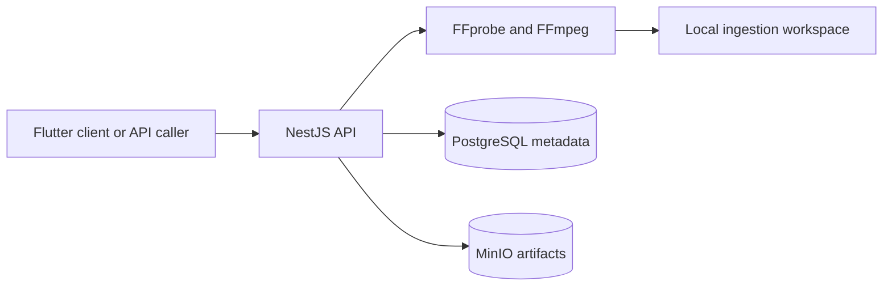

# Aria

Aria is an artifact-first foundation for multimodal song production. The current repository accepts text briefs and optional audio/video inputs, preserves and normalizes uploaded media, and stores versioned project/artifact metadata. Acoustic analysis and input interpretation are the next implementation phase.

## Current architecture

```text
aria/
├── apps/
│   └── mobile/                 # Flutter project/input client
├── infrastructure/
│   └── minio/                  # Local object-storage TLS assets
├── services/
│   └── api/                    # NestJS ingestion, projects, artifacts, and health
├── docker-compose.yml
└── README.md
```



The earlier LangGraph agent and placeholder lyrics, composition, and mixing microservices were removed before Phase 2. They generated prototype output but did not fit the artifact-first input-analysis boundary. Generation services will be introduced later behind versioned artifact contracts when their phases are implemented.

## Technology choices

| Layer | Choice | Current responsibility |
|-------|--------|------------------------|
| Mobile | Flutter | Create a brief, upload media, and inspect project/input readiness |
| Public API | NestJS + TypeScript | Validate requests, ingest media, and expose projects/artifacts |
| Media tools | FFprobe + FFmpeg | Inspect, extract, measure, and normalize accepted media |
| Metadata | PostgreSQL + Prisma | Projects, artifacts, versions, lineage, provenance, reviews, and edits |
| Binary artifacts | MinIO / S3-compatible storage | Private immutable objects and signed upload/download URLs |
| Local deployment | Docker Compose | API, PostgreSQL, MinIO, and bucket initialization |

## Quick start

### Prerequisites

- Docker and Docker Compose
- Node.js 20+ and npm for local API development
- Flutter SDK for the mobile client
- FFmpeg 6+ when running the API outside Docker

### 1. Configure the environment

```bash
cp .env.example .env
```

Replace the development PostgreSQL and MinIO credentials before exposing the stack outside a local machine.

### 2. Start the backend

```bash
docker compose up --build
```

| Service | Port | Role |
|---------|------|------|
| API | 8010 | Public project, ingestion, and artifact API |
| PostgreSQL | 5432 | Project/artifact metadata and lineage |
| MinIO | 9000 / 9001 | Private artifact objects / local administration console |

The API container applies pending Prisma migrations before startup. `minio-init` creates the private `aria-artifacts` bucket after MinIO becomes healthy.

### 3. Run the Flutter client

For a browser preview:

```bash
cd apps/mobile
flutter pub get
flutter run -d web-server --web-hostname 127.0.0.1 --web-port 3000 \
  --dart-define=ARIA_API_URL=http://localhost:8010
```

For Android emulators, use `http://10.0.2.2:8010`; iOS simulators and desktop targets can use `http://localhost:8010`. Physical devices require the development machine's reachable LAN address.

The client creates either a text-only `draft` project or an `input_ready` project after media passes ingestion and normalization. Song generation is intentionally unavailable until its later pipeline phases are implemented.

## API overview

### Health

```bash
curl http://localhost:8010/health
```

### Create a text-only draft

```bash
curl -X POST http://localhost:8010/songs \
  -H 'Content-Type: application/json' \
  -d '{
    "idea": "A rainy night in the city, feeling hopeful",
    "mood": "chill",
    "genre": "r-and-b",
    "length": "medium",
    "vocal_style": "female"
  }'
```

### Create a project with media

```bash
curl -X POST http://localhost:8010/songs \
  -F 'media=@inspiration.mp3' \
  -F 'idea=Prepare this reference for a new song project' \
  -F 'media_purpose=mixture' \
  -F 'mood=energetic' \
  -F 'genre=pop'
```

Use `media_purpose=voice` only for known isolated speech, singing, or humming. Use `mixture` for instrument recordings, mixes, and reference songs. Phase 2 will replace this coarse upload hint with acoustic classification and a correctable interpretation.

The response contains `project_id`, a `draft` or `input_ready` stage, a project summary, and the public input manifest when media was supplied.

### Read project state

```bash
curl http://localhost:8010/songs/{projectId}
curl http://localhost:8010/projects/{projectId}
```

The compatibility `/songs/{projectId}` view returns the brief, stage, status, and artifacts. `/projects/{projectId}` returns the canonical Prisma project record.

The complete contract is in [services/api/openapi.yaml](services/api/openapi.yaml).

## Media ingestion

The multipart `media` field accepts MP3, WAV, FLAC, AAC/M4A, OGG/Opus, WMA, MP4/MOV, WebM/MKV, MPEG, and AVI when FFprobe confirms a supported audio stream.

For each accepted upload, ingestion:

1. validates request limits and media policy;
2. preserves the source under an opaque identifier and SHA-256 checksum;
3. records bounded FFprobe metadata and warnings;
4. creates a 48 kHz, 24-bit working WAV—stereo for mixtures and mono for known isolated voice;
5. writes an input manifest without exposing host filesystem paths.

Unsupported, malformed, no-audio, silence-only, excessive-duration, oversized, and excessively clipped uploads return structured 4xx errors with stable codes.

### Ingestion configuration

| Variable | Default | Purpose |
|----------|---------|---------|
| `API_PORT` | `8010` | Public API port |
| `MEDIA_STORAGE_DIR` | `outputs` | Source media, normalized audio, and manifests |
| `MEDIA_TEMP_DIR` | `<MEDIA_STORAGE_DIR>/.tmp` | Bounded multipart staging area |
| `MAX_UPLOAD_BYTES` | `262144000` | Maximum encoded upload size |
| `MAX_MEDIA_DURATION_SECONDS` | `1800` | Maximum decoded duration |
| `MAX_MEDIA_STREAMS` | `16` | Maximum accepted streams per container |
| `MEDIA_PROCESS_TIMEOUT_MS` | `120000` | Timeout for each FFmpeg/FFprobe invocation |
| `MEDIA_SILENCE_THRESHOLD_DB` | `-60` | Silence-only threshold |
| `MEDIA_CLIPPING_WARNING_DB` | `-0.1` | Peak level that produces a clipping warning |
| `MEDIA_MAX_CLIPPING_RATIO` | `0.01` | Estimated clipped-sample ratio that rejects an upload |

The default upload scanner is a replaceable no-op provider. Production deployments must supply a malware/content-scanning implementation.

## Artifact storage

PostgreSQL stores project and artifact metadata, versions, dependency edges, provenance, quality scores, human edits, pipeline phase, and review state. Media and generated files belong in object storage rather than database JSON.

Object keys follow `projects/{projectId}/{namespace}/{artifactId}/{fileName}`. The API exposes opaque artifact IDs and short-lived signed URLs, never object keys or host paths. Originals and final artifacts are deletion-protected; referenced intermediates cannot be deleted while active descendants exist.

Create a pending analysis artifact and signed upload URL with:

```bash
curl -X POST http://localhost:8010/projects/{projectId}/artifacts/upload-url \
  -H 'Content-Type: application/json' \
  -d '{
    "artifactType":"ANALYSIS",
    "namespace":"ANALYSIS",
    "retentionClass":"INTERMEDIATE",
    "logicalName":"acoustic-analysis",
    "fileName":"acoustic.json",
    "contentType":"application/json"
  }'
```

After a worker verifies and marks the artifact available, request a signed download at `GET /projects/{projectId}/artifacts/{artifactId}/download-url`. Signed URL lifetimes are configurable from 60 to 3600 seconds and default to 900 seconds.

The versioned payload contracts live in `services/api/src/artifacts/artifact.contracts.ts`; the database schema and migrations live under `services/api/prisma`.

### Backup and restore

PostgreSQL metadata and MinIO objects form one logical backup and must be captured at the same application quiescence point:

```bash
docker compose exec -T postgres pg_dump -U aria -d aria -Fc > aria-postgres.dump
docker run --rm -v aria_minio_data:/source:ro -v "$PWD/backups:/backup" alpine \
  tar -C /source -czf /backup/aria-minio.tgz .
```

For restore, stop API writes, restore PostgreSQL with `pg_restore --clean --if-exists`, restore the MinIO volume, start PostgreSQL and MinIO, deploy Prisma migrations, and verify sample checksums through signed downloads before resuming writes.

## Local API development

Start PostgreSQL and MinIO, then run:

```bash
cd services/api
npm install
npm run prisma:migrate:deploy
npm test
npm run build
node dist/main.js
```

## Next phase

Phase 2 adds deterministic acoustic measurements, frozen-model audio embeddings, calibrated input classification, immutable interpretation artifacts, and explicit user confirmation/correction. See `plan/phase-2-input-interpretation.md` in a local planning workspace.

## License

MIT
