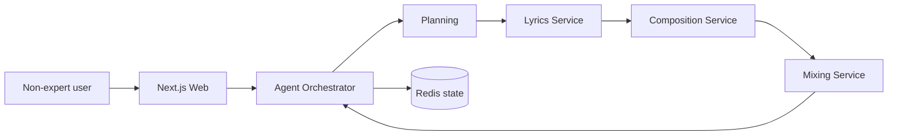

# Aria

An AI agent monorepo that helps **non-experts** create complete songs — from a plain-language idea through planning, lyrics, composition, and mixing.

## Architecture

```
aria/
├── apps/
│   └── web/                    # Next.js UI (guided song creation wizard)
├── packages/
│   └── shared-types/           # TypeScript contracts shared with the frontend
├── services/
│   ├── agent/                  # LangGraph orchestrator (plan → lyrics → compose → mix)
│   ├── lyrics/                 # Lyric generation service
│   ├── composition/            # MIDI + stem generation service
│   └── mixing/                 # Stem mixing + loudness normalization
├── docker-compose.yml
└── package.json                # pnpm + Turborepo root
```



## Technology choices

| Layer | Choice | Why |
|-------|--------|-----|
| **Monorepo** | pnpm workspaces + Turborepo | Fast installs, cached builds, clean separation between UI and services while sharing types |
| **Frontend** | TypeScript + Next.js 15 + React 19 | Best-in-class DX for accessible, guided UIs; SSR-ready; non-experts need a simple wizard, not a CLI |
| **Agent orchestration** | Python + LangGraph | Song creation is a multi-step state machine (plan → lyrics → compose → mix). LangGraph models this naturally with checkpoints, retries, and future human-in-the-loop edits |
| **LLM integration** | LangChain + OpenAI | Mature tooling for structured JSON outputs in planning and lyrics; works without an API key via template fallbacks for local dev |
| **Microservices** | FastAPI (Python) | Each creative step is CPU/GPU-intensive and independently scalable; FastAPI gives async I/O, auto OpenAPI docs, and Pydantic validation |
| **Audio** | midiutil, numpy, scipy | Lightweight, no-GPU local dev path; composition generates MIDI + stems, mixing applies EQ/normalization. Swap internals for MusicGen, Suno, or Udio APIs in production |
| **State** | Redis | Fast project polling from the web UI while long-running pipelines execute |
| **Persistence** | PostgreSQL (ready) | Project history and user accounts; wired in docker-compose for future use |
| **Containers** | Docker Compose | One command to run the full stack locally |

### Why Python for AI services and TypeScript for the UI?

Python dominates the AI/ML ecosystem (LangChain, audio libraries, model hosting). TypeScript dominates interactive web UIs. A polyglot monorepo lets each layer use the best tool without forcing Python into the frontend or React into the agent.

### Why microservices instead of one monolith?

Planning, lyrics, composition, and mixing have different resource profiles (LLM calls vs. DSP vs. future GPU inference). Splitting them lets you scale composition/mixing on GPU nodes while keeping lightweight LLM services on CPU instances.

## Quick start

### Prerequisites

- Node.js 20+
- pnpm 9+
- Docker & Docker Compose
- (Optional) `OPENAI_API_KEY` for higher-quality planning and lyrics

### 1. Install frontend dependencies

```bash
pnpm install
```

### 2. Configure environment

```bash
cp .env.example .env
# Add OPENAI_API_KEY=sk-... for LLM-powered output (optional)
```

### 3. Start backend services

```bash
docker compose up --build
```

Services:

| Service | Port | Role |
|---------|------|------|
| Agent | 8000 | Orchestrates the pipeline |
| Lyrics | 8001 | Generates lyrics |
| Composition | 8002 | Creates MIDI + stems |
| Mixing | 8003 | Produces final WAV |
| Postgres | 5432 | Persistence (future) |
| Redis | 6379 | Project state |

### 4. Start the web app

```bash
pnpm dev:web
```

Open [http://localhost:3000](http://localhost:3000), describe your song, and watch the pipeline progress.

## API overview

**Create a song** (agent):

```bash
curl -X POST http://localhost:8000/songs \
  -H "Content-Type: application/json" \
  -d '{
    "idea": "A rainy night in the city, feeling hopeful",
    "mood": "chill",
    "genre": "r-and-b",
    "length": "medium",
    "vocal_style": "female"
  }'
```

**Poll status**:

```bash
curl http://localhost:8000/songs/{project_id}
```

## Local development (without Docker)

Run each Python service in its own terminal:

```bash
cd services/agent && pip install -e . && uvicorn agent.main:app --reload --port 8000
cd services/lyrics && pip install -e . && uvicorn lyrics.main:app --reload --port 8001
cd services/composition && pip install -e . && uvicorn composition.main:app --reload --port 8002
cd services/mixing && pip install -e . && uvicorn mixing.main:app --reload --port 8003
```

You also need Redis running locally (`redis-server` or Docker).

## Production upgrades

The scaffold uses template/MIDI fallbacks so the full pipeline runs without paid APIs. To reach production quality:

1. **Lyrics / Planning** — Connect `OPENAI_API_KEY` or any OpenAI-compatible endpoint
2. **Composition** — Replace MIDI generator with [MusicGen](https://github.com/facebookresearch/audiocraft), Stable Audio, Suno, or Udio
3. **Mixing** — Add `pyloudnorm` + `pedalboard` for pro-grade mastering
4. **Vocals** — Integrate a singing voice synthesis API (e.g. ACE Studio, Kits.ai)
5. **Storage** — Serve final audio via S3/Cloudflare R2 instead of local paths

## License

MIT
