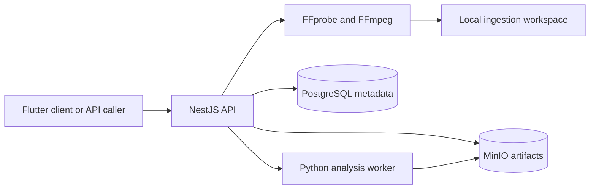

# Aria

Aria is an artifact-first foundation for multimodal song production. It accepts text briefs and optional audio/video inputs, preserves and normalizes media, measures acoustic properties, extracts frozen YAMNet embeddings, classifies the input, and pauses for an explicit user confirmation or correction when the interpretation is uncertain.

## Current architecture

```text
aria/
├── apps/
│   └── mobile/                 # Flutter project/input client
├── infrastructure/
│   └── minio/                  # Local object-storage TLS assets
├── services/
│   ├── api/                    # NestJS ingestion, artifacts, analysis coordination, and review
│   └── analysis/               # Pinned Python DSP and YAMNet inference worker
├── docker-compose.yml
└── README.md
```



The earlier LangGraph agent and placeholder lyrics, composition, and mixing microservices were removed before Phase 2. They generated prototype output but did not fit the artifact-first input-analysis boundary. Generation services will be introduced later behind versioned artifact contracts when their phases are implemented.

## Technology choices

| Layer | Choice | Current responsibility |
|-------|--------|------------------------|
| Mobile | Flutter | Create a brief, upload media, and confirm/correct the input interpretation |
| Public API | NestJS + TypeScript | Ingest media, coordinate verified analysis, version interpretations, and expose projects/artifacts |
| Analysis worker | Python, SciPy, TensorFlow | Deterministic acoustic features, YAMNet segment embeddings, and AudioSet-assisted baseline classification |
| Media tools | FFprobe + FFmpeg | Inspect, extract, measure, and normalize accepted media |
| Metadata | PostgreSQL + Prisma | Projects, artifacts, versions, lineage, provenance, reviews, and edits |
| Binary artifacts | MinIO / S3-compatible storage | Private immutable objects and signed upload/download URLs |
| Local deployment | Docker Compose | API, analysis worker, PostgreSQL, MinIO, and bucket initialization |

## Quick start

### Prerequisites

- Docker and Docker Compose
- Node.js 20+ and npm for local API development
- Flutter SDK for the mobile client
- FFmpeg 6+ when running the API outside Docker

### 1. Configure the environment

```bash
cp .env.example .env
```

Replace the development PostgreSQL and MinIO credentials before exposing the stack outside a local machine.

### 2. Start the backend

```bash
docker compose up --build
```

| Service | Port | Role |
|---------|------|------|
| API | 8010 | Public project, ingestion, and artifact API |
| Analysis | internal 8020 | DSP, frozen embedding, and classification worker |
| PostgreSQL | 5432 | Project/artifact metadata and lineage |
| MinIO | 9000 / 9001 | Private artifact objects / local administration console |

The API container applies pending Prisma migrations before startup. `minio-init` creates the private `aria-artifacts` bucket after MinIO becomes healthy.

### 3. Run the Flutter mobile app

Install the mobile dependencies and list the available Android or iOS devices:

```bash
cd apps/mobile
flutter pub get
flutter devices
```

Run on an Android emulator, using Android's host-machine alias for the API:

```bash
flutter run -d <android-device-id> \
  --dart-define=ARIA_API_URL=http://10.0.2.2:8010
```

Run on an iOS Simulator:

```bash
flutter run -d <ios-simulator-id> \
  --dart-define=ARIA_API_URL=http://localhost:8010
```

For a physical Android or iOS device, connect the device to the development machine and use the machine's reachable LAN address:

```bash
flutter run -d <device-id> \
  --dart-define=ARIA_API_URL=http://<development-machine-lan-ip>:8010
```

The backend must remain running while the app is in use. For a physical device, the device and development machine must be on the same network, and local firewall rules must allow access to port `8010`.

The client creates either a text-only `draft` project or analyzes uploaded media. Ambiguous classification enters `awaiting_input_review`; confirmation or correction advances it to `input_interpreted`. Song generation is intentionally unavailable until its later pipeline phases are implemented.

## API overview

### Health

```bash
curl http://localhost:8010/health
```

### Create a text-only draft

```bash
curl -X POST http://localhost:8010/songs \
  -H 'Content-Type: application/json' \
  -d '{
    "idea": "A rainy night in the city, feeling hopeful",
    "mood": "chill",
    "genre": "r-and-b",
    "length": "medium",
    "vocal_style": "female"
  }'
```

### Create a project with media

```bash
curl -X POST http://localhost:8010/songs \
  -F 'media=@inspiration.mp3' \
  -F 'idea=Prepare this reference for a new song project' \
  -F 'media_purpose=mixture' \
  -F 'mood=energetic' \
  -F 'genre=pop'
```

Use `media_purpose=voice` only for known isolated speech, singing, or humming. Use `mixture` for instrument recordings, mixes, and reference songs. This hint selects the normalization channel profile; Phase 2 independently infers a correctable source type and likely uses.

The response contains `project_id`, the project stage, a project summary, the public input manifest, and the active interpretation when media was supplied.

### Review or correct an interpretation

The public `inputId` is the input-manifest artifact ID returned by upload. Read the current version and correction options, then submit the version you reviewed:

```bash
curl http://localhost:8010/projects/{projectId}/inputs/{inputId}/interpretation

curl -X PATCH http://localhost:8010/projects/{projectId}/inputs/{inputId}/interpretation \
  -H 'Content-Type: application/json' \
  -H 'x-editor-id: local-user' \
  -d '{
    "baseVersion": 1,
    "sourceType": "humming",
    "intendedUses": ["extract_melody", "continue_recording"]
  }'
```

Each correction creates a new immutable `input-interpretation` artifact, appends an audit edit, and atomically advances the active head. A stale `baseVersion` returns `409 Conflict`. `x-editor-id` is only a local audit label; deployments with multiple users must add authentication and project authorization before exposure.

### Read project state

```bash
curl http://localhost:8010/songs/{projectId}
curl http://localhost:8010/projects/{projectId}
```

The compatibility `/songs/{projectId}` view returns the brief, stage, status, and artifacts. `/projects/{projectId}` returns the canonical Prisma project record.

The complete contract is in [services/api/openapi.yaml](services/api/openapi.yaml).

## Media ingestion

The multipart `media` field accepts MP3, WAV, FLAC, AAC/M4A, OGG/Opus, WMA, MP4/MOV, WebM/MKV, MPEG, and AVI when FFprobe confirms a supported audio stream.

For each accepted upload, ingestion:

1. validates request limits and media policy;
2. preserves the source under an opaque identifier and SHA-256 checksum;
3. records bounded FFprobe metadata and warnings;
4. creates a 48 kHz, 24-bit working WAV—stereo for mixtures and mono for known isolated voice;
5. registers and uploads the original, working WAV, raw probe, and manifest as canonical versioned artifacts without exposing host filesystem paths.

Unsupported, malformed, no-audio, silence-only, excessive-duration, oversized, and excessively clipped uploads return structured 4xx errors with stable codes.

### Ingestion configuration

| Variable | Default | Purpose |
|----------|---------|---------|
| `API_PORT` | `8010` | Public API port |
| `MEDIA_STORAGE_DIR` | `outputs` | Source media, normalized audio, and manifests |
| `MEDIA_TEMP_DIR` | `<MEDIA_STORAGE_DIR>/.tmp` | Bounded multipart staging area |
| `MAX_UPLOAD_BYTES` | `262144000` | Maximum encoded upload size |
| `MAX_MEDIA_DURATION_SECONDS` | `1800` | Maximum decoded duration |
| `MAX_MEDIA_STREAMS` | `16` | Maximum accepted streams per container |
| `MEDIA_PROCESS_TIMEOUT_MS` | `120000` | Timeout for each FFmpeg/FFprobe invocation |
| `MEDIA_SILENCE_THRESHOLD_DB` | `-60` | Silence-only threshold |
| `MEDIA_CLIPPING_WARNING_DB` | `-0.1` | Peak level that produces a clipping warning |
| `MEDIA_MAX_CLIPPING_RATIO` | `0.01` | Estimated clipped-sample ratio that rejects an upload |

The default upload scanner is a replaceable no-op provider. Production deployments must supply a malware/content-scanning implementation.

## Phase 2 analysis

The API sends only the immutable 48 kHz working WAV to the internal worker through short-lived MinIO URLs. The worker produces three separate verified artifacts:

- `acoustic.json` with level, loudness, clipping, silence, SNR, tempo candidates, channel correlation, and bounded spectral/MFCC summaries;
- `embeddings.npz` with timestamped 1024-dimensional YAMNet segment vectors plus file-level mean and standard deviation;
- `classification.json` with ranked source and music-scope candidates, model/weight/preprocessing provenance, warnings, and a review recommendation.

YAMNet is a frozen pretrained AudioSet encoder, not a model trained on user uploads. The current classifier is an explicitly versioned AudioSet-score/rule baseline and abstains to `unknown`/`needs_review` when confidence or acoustic evidence is insufficient. User corrections change only the interpretation artifact; measurements, embeddings, and classification remain immutable. Embeddings are canonical in object storage and are not returned by the public API.

| Variable | Default | Purpose |
|----------|---------|---------|
| `ANALYSIS_ENABLED` | `false` outside Compose, `true` in Compose | Enable synchronous Phase 2 analysis |
| `ANALYSIS_WORKER_URL` | `http://analysis:8020` | Internal worker base URL |
| `ANALYSIS_TIMEOUT_MS` | `300000` | End-to-end worker request timeout |
| `ANALYSIS_MANDATORY_REVIEW` | `false` | Force review even when the baseline recommends auto-accept |

## Artifact storage

PostgreSQL stores project and artifact metadata, versions, dependency edges, provenance, quality scores, human edits, pipeline phase, and review state. Media and generated files belong in object storage rather than database JSON.

Object keys follow `projects/{projectId}/{namespace}/{artifactId}/{fileName}`. The API exposes opaque artifact IDs and short-lived signed URLs, never object keys or host paths. Originals and final artifacts are deletion-protected; referenced intermediates cannot be deleted while active descendants exist.

Create a pending analysis artifact and signed upload URL with:

```bash
curl -X POST http://localhost:8010/projects/{projectId}/artifacts/upload-url \
  -H 'Content-Type: application/json' \
  -d '{
    "artifactType":"ANALYSIS",
    "namespace":"ANALYSIS",
    "retentionClass":"INTERMEDIATE",
    "logicalName":"acoustic-analysis",
    "fileName":"acoustic.json",
    "contentType":"application/json"
  }'
```

After a worker verifies and marks the artifact available, request a signed download at `GET /projects/{projectId}/artifacts/{artifactId}/download-url`. Signed URL lifetimes are configurable from 60 to 3600 seconds and default to 900 seconds.

The versioned payload contracts live in `services/api/src/artifacts/artifact.contracts.ts`; the database schema and migrations live under `services/api/prisma`.

### Backup and restore

PostgreSQL metadata and MinIO objects form one logical backup and must be captured at the same application quiescence point:

```bash
docker compose exec -T postgres pg_dump -U aria -d aria -Fc > aria-postgres.dump
docker run --rm -v aria_minio_data:/source:ro -v "$PWD/backups:/backup" alpine \
  tar -C /source -czf /backup/aria-minio.tgz .
```

For restore, stop API writes, restore PostgreSQL with `pg_restore --clean --if-exists`, restore the MinIO volume, start PostgreSQL and MinIO, deploy Prisma migrations, and verify sample checksums through signed downloads before resuming writes.

## Local API development

Start PostgreSQL and MinIO, then run:

```bash
cd services/api
npm install
npm run prisma:migrate:deploy
npm test
npm run build
node dist/main.js
```

## Input intelligence sprint (FR-001 – FR-007)

The input intelligence milestone is implemented across the API and mobile client:

- **Canonical projects:** `POST /projects` accepts the structured brief (including optional `audience` and `deliverables`).
- **Compatibility:** `POST /songs` still creates projects with optional media upload and analysis.
- **Text/lyrics inputs:** `POST /projects/{projectId}/inputs` registers inline text or lyrics as an input manifest.
- **Artifacts:** `GET /projects/{projectId}/artifacts` lists artifacts with cursor pagination; `GET .../artifacts/{artifactId}/lineage` returns lineage summaries.
- **Interpretation:** responses include `evidenceSummary`; corrections return `staleArtifactIds` when taxonomy changes invalidate dependents.
- **Mobile:** text-only create uses `/projects`; resume-by-ID, audience field, and interpretation confidence display are available on the home screen.

Detailed plan: [plans/input-intelligence-sprint/implementation-plan.md](plans/input-intelligence-sprint/implementation-plan.md)

## Musical understanding sprint (FR-008 – FR-009)

Phase 3 musical understanding is implemented across the API, analysis worker, and mobile client:

- **Generation:** `POST /projects/{projectId}/audio-understanding` returns `202 Accepted` with a minimal `WorkflowRun`; requires an approved interpretation.
- **Retrieval:** `GET /projects/{projectId}/audio-understanding` returns a structured summary, stale flag, and signed download URL for the full JSON payload.
- **Workflow poll:** `GET /projects/{projectId}/workflow-runs/{runId}` exposes run status (`running`, `succeeded`, `partial`, `failed`).
- **Worker:** `POST /understand` fuses timing, structure, harmony, timbre, texture, and semantic modules; separation and transcription abstain in the MVP CPU baseline.
- **Mobile:** "Analyze music" after interpretation approval; summary shows tempo, key, sections, and semantic tags.

Detailed plan: [plans/musical-understanding-sprint/implementation-plan.md](plans/musical-understanding-sprint/implementation-plan.md)

## Next phase

Phase 4 can consume approved AudioUnderstanding artifacts to resolve requirements and propose creative directions (FR-010+). Training and calibrating a project-specific classifier remains a data/evaluation workstream; the shipped Phase 2 baseline does not claim calibration it has not earned.

## License

MIT
