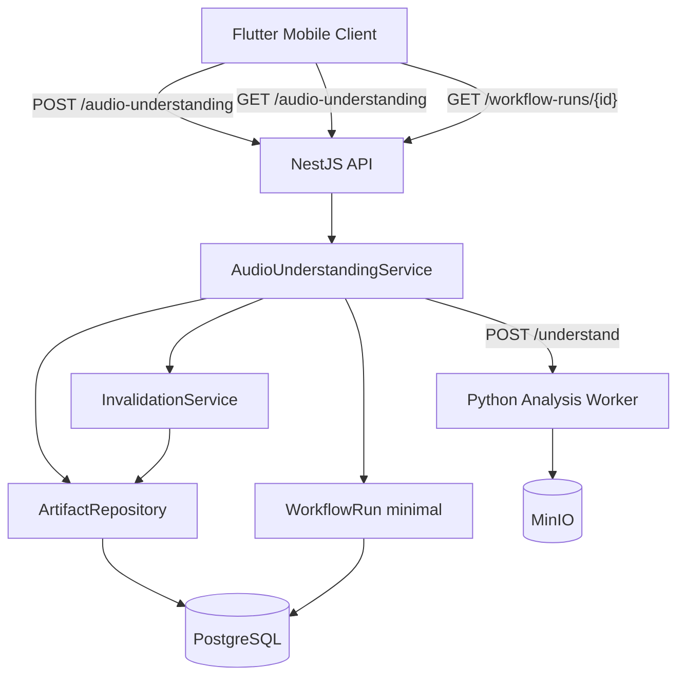
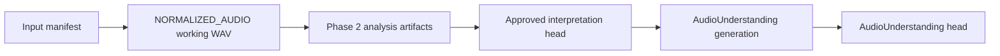

# Implementation Plan: Musical Understanding Sprint (FR-008 – FR-009)

**Feature slug:** `musical-understanding-sprint`  
**Spec:** `.spec/functional-requirements/FR-008-audio-understanding-generation.md`, `.spec/functional-requirements/FR-009-audio-understanding-retrieval.md`  
**Product milestone:** Musical understanding (legacy Phase 3)  
**Last updated:** 2026-07-22 (Phase 5 complete; musical understanding sprint delivered)  
**Overall status:** ✅ Complete

---

## 1. Summary

This sprint delivers **Phase 3 musical understanding**: a versioned **AudioUnderstanding** artifact produced by fusing modular analysis outputs (separation, transcription, timing, melody, harmony, structure, timbre, texture, semantic descriptors) with explicit uncertainty, plus a public API to **generate** and **retrieve** that artifact for review and downstream composition planning (FR-010+).

The sprint builds on the completed **input intelligence baseline** (FR-001–FR-007): normalized working WAV, Phase 2 analysis artifacts (acoustic, embeddings, classification), approved interpretation heads, artifact registry with lineage, and selective invalidation on interpretation correction.

### Scope by surface

| Surface | Package / app | Role in this sprint |
| ------- | ------------- | ------------------- |
| Backend | `services/api` | AudioUnderstanding contracts, generation command, retrieval resource, minimal WorkflowRun, invalidation integration, OpenAPI |
| Analysis worker | `services/analysis` | `/understand` ensemble endpoint, modular analyzers, fusion with uncertainty, intermediate artifact uploads |
| Client | `apps/mobile` | Trigger understanding after interpretation approval, poll workflow status, display structured summary |
| Admin | — | Not in scope |
| Infrastructure | `docker-compose`, MinIO, PostgreSQL | Extended analysis timeout; optional GPU profile documented as OPEN-4 |

### Out of sprint scope

- FR-010+ (requirements resolution, creative direction, composition)
- Full WorkflowRun platform (FR-028 cancel/retry, FR-029, FR-034) — minimal run record only; full observability deferred
- Production-grade separation (Demucs) and transcription (Whisper) — MVP uses abstention/stub modules with partial fusion (OPEN-2)
- Full authentication / RBAC (FR-035) — interim `x-editor-id` project scoping only
- GPU worker deployment — CPU baseline in docker-compose; GPU path documented for staging

---

## 2. Current State vs Target

### Gap analysis

| Area | Current | Target (FR acceptance) |
| ---- | ------- | ---------------------- |
| **FR-008 Generation** | Phase 2 `/analyze` produces acoustic + embeddings + classification only; no fused musical artifact | Versioned AudioUnderstanding linked to source input + **approved** interpretation; section-level + global descriptors; uncertainty on disagreement; async command returns trackable WorkflowRun; optional module failure preserves partial fusion |
| **FR-009 Retrieval** | No `/audio-understanding` resource | Project exposes AudioUnderstanding when available; summary via API + signed URL for full payload; version/lineage; stale/not-found semantics; project-scoped access |
| **Worker ensemble** | YAMNet baseline + scipy acoustic features | Modular pipeline: timing, structure, harmony, melody, timbre, texture, semantic (+ separation/transcription stubs) |
| **Orchestration** | Inline synchronous `AnalysisService.analyze()` | `POST` returns `202 Accepted` + WorkflowRun; stages updated during worker call; partial completion on optional failures |
| **Data model** | `ArtifactType.ANALYSIS` for all analysis outputs; `InputInterpretationHead` only | `AudioUnderstandingHead` per input; module sub-artifacts; minimal `workflow_runs` table |
| **Staleness** | Invalidation marks dependents `SUPERSEDED` on interpretation correction | AudioUnderstanding head + modules invalidated when interpretation taxonomy changes |
| **Mobile** | Interpretation review only | Approve → generate understanding → view tempo/key/sections summary |

### Target architecture



**Generation precondition chain:**



---

## 3. Data Model Changes

| Package | Change | Migration notes |
| ------- | ------ | --------------- |
| `services/api` | New `AudioUnderstandingHead` — `(inputManifestId → activeArtifactId, version, interpretationArtifactId)` | New table `audio_understanding_heads`; FK to `artifacts` |
| `services/api` | New `WorkflowRun` — minimal subset for FR-008 async tracking | New table `workflow_runs`: `id`, `project_id`, `kind`, `status`, `stage`, `progress`, `correlation_id`, `input_manifest_id`, `result_artifact_id`, `error`, `metadata`, timestamps |
| `services/api` | Optional: `ArtifactType.AUDIO_UNDERSTANDING` enum value | **Recommendation (OPEN-1):** add enum value vs reuse `ANALYSIS` with `logicalName` prefix `audio-understanding-*` — prefer dedicated type for FR-009 filtering |
| `services/api` | Module sub-artifacts remain `ANALYSIS` namespace, `pipelinePhase: 'understanding'` | No enum change required for intermediates |
| `services/analysis` | No DB; JSON schemas versioned in worker + mirrored in API contracts | `UNDERSTANDING_SCHEMA_VERSION = '3.0.0'` |

### AudioUnderstanding payload contract (v3.0.0 sketch)

| Section | Fields | Notes |
| ------- | ------ | ----- |
| `global` | `durationSeconds`, `tempo`, `key`, `timeSignature`, `loudness`, `semanticTags` | Tempo/key carry confidence + candidate lists |
| `sections[]` | `id`, `startSeconds`, `endSeconds`, `label`, `tempo`, `key`, `energy`, `semanticTags` | Structure module output |
| `modules` | `separation`, `transcription`, `timing`, `melody`, `harmony`, `structure`, `timbre`, `texture`, `semantic` | Each: `status`, `artifactId?`, `confidence`, `summary`, `warnings[]` |
| `fusion` | `uncertainties[]`, `conflicts[]` | FR-008 disagreement / abstention |
| `lineage` | `inputId`, `workingArtifactId`, `interpretationArtifactId`, `interpretationVersion`, `sourceArtifactIds[]` | FR-009 lineage |

### Indexes / performance

| Query / access pattern | Index | Notes |
| ---------------------- | ----- | ----- |
| Active understanding by input | PK on `audio_understanding_heads.input_manifest_id` | Same pattern as interpretation head |
| List workflow runs by project | `(project_id, created_at DESC)` on `workflow_runs` | Interim until FR-028 list endpoint |
| Find understanding artifacts | `(project_id, type, logical_name)` existing unique | Filter `AUDIO_UNDERSTANDING` or `audio-understanding-*` |

---

## 4. Backend Implementation

| Area | Files / modules | Behavior |
| ---- | --------------- | -------- |
| Contracts | `src/understanding/understanding.contracts.ts` | `AudioUnderstanding`, `ModuleResult`, `UnderstandingSummary`, schema version constants |
| Repository | `src/understanding/understanding.repository.ts` | Head CRUD; resolve active vs historical versions |
| Service | `src/understanding/understanding.service.ts` | Eligibility checks; orchestrate worker; fuse registration; head advance |
| Workflow | `src/workflows/workflow-run.repository.ts`, `workflow-run.service.ts` | Create/update run; map stages (`preparing`, `worker`, `persisting`, `complete`) |
| Controller | `src/understanding/understanding.controller.ts` | POST generate (202), GET latest, GET by artifact id |
| Invalidation | extend `invalidation.service.ts` | Register AudioUnderstanding + modules as dependents of interpretation artifact |
| Serialization | `src/understanding/serialize-understanding.ts` | API summary (no object keys); signed download for full JSON |
| Config | `src/config.ts` | `UNDERSTANDING_ENABLED`, `UNDERSTANDING_TIMEOUT_MS` (default 600000) |

### APIs

| Method | Path | Purpose | FR |
| ------ | ---- | ------- | -- |
| POST | `/projects/{projectId}/audio-understanding` | Start generation (`{ inputId }`); returns `202` + `WorkflowRun` | FR-008 |
| GET | `/projects/{projectId}/audio-understanding` | Latest head summary + `stale` flag + download URL | FR-009 |
| GET | `/projects/{projectId}/audio-understanding/{artifactId}` | Specific version summary + download URL | FR-009 |
| GET | `/projects/{projectId}/workflow-runs/{runId}` | Minimal status poll for generation (interim FR-028) | FR-008 |

**Eligibility rules (generation):**

- Input manifest exists and belongs to project
- Working `NORMALIZED_AUDIO` artifact available
- Interpretation head exists with `reviewStatus ∈ { auto_accepted, user_confirmed, user_corrected }` (reject `needs_review`)
- Phase 2 analysis artifacts available (acoustic, classification) — re-run analyze if missing
- Idempotent: if active understanding exists for same interpretation artifact id + version, return existing head (unless `force: true`)

**Stale semantics (retrieval):**

- `stale: true` when head artifact `status === SUPERSEDED` OR active interpretation version > understanding's recorded `interpretationVersion`
- `404` with code `AUDIO_UNDERSTANDING_NOT_FOUND` when no head ever created
- `409` with code `INTERPRETATION_NOT_APPROVED` on generation when interpretation still `needs_review`

---

## 5. Admin / Configuration

| Area | Files / components | Behavior |
| ---- | ------------------ | -------- |
| Env vars | `docker-compose.yml`, `services/api/src/config.ts` | `UNDERSTANDING_ENABLED`, `UNDERSTANDING_TIMEOUT_MS`, `UNDERSTANDING_OPTIONAL_MODULES` |
| Worker modules | `services/analysis` env | Comma-separated optional module list; failures abstain instead of failing run |

Not in scope: operator UI for model registry or module toggles.

---

## 6. Client / Consumer

| Area | Files / components | Behavior |
| ---- | ------------------ | -------- |
| API client | `apps/mobile/lib/main.dart` or extracted service | POST generate; poll `workflow-runs/{id}` until terminal state |
| UX | Home / project detail | After interpretation confirmed, show "Analyze music" CTA |
| Summary card | New widget section | Display global tempo, key, section count, top semantic tags, module warnings |
| Errors | Existing patterns | Handle 409 (needs review), 404 (not ready), stale badge with regenerate action |

---

## 7. Integrations

| System | Touchpoints | Notes |
| ------ | ----------- | ----- |
| Python analysis worker | `POST /understand` | Accepts signed URLs for source + Phase 2 inputs; uploads module + fused outputs |
| MinIO | Signed upload/download | Same pattern as Phase 2 analyze |
| Phase 2 artifacts | acoustic.json, classification.json, embeddings.npz | Reuse as module inputs; avoid re-computing YAMNet when checksums match |
| Invalidation graph | interpretation → understanding | Wire on correction (already returns `staleArtifactIds`) |

### Worker `/understand` request (sketch)

```json
{
  "schemaVersion": "3.0.0",
  "projectId": "...",
  "inputId": "...",
  "interpretation": { "sourceType": "mixed_music", "musicScope": "full_song", "intendedUses": ["use_as_style_reference"] },
  "source": { "url": "...", "headers": {}, "checksumSha256": "..." },
  "inputs": {
    "acoustic": { "url": "...", "checksumSha256": "..." },
    "classification": { "url": "...", "checksumSha256": "..." },
    "embeddings": { "url": "...", "checksumSha256": "..." }
  },
  "outputs": {
    "modules": { "timing": { "url": "...", "headers": {} }, "...": {} },
    "understanding": { "url": "...", "headers": {} }
  },
  "policy": { "optionalModules": ["separation", "transcription"], "maxDurationSeconds": 1800 }
}
```

---

## 8. Requirements Checklist

| ID | Requirement (summary) | Owner / surface | Phase | Status |
| -- | --------------------- | --------------- | ----- | ------ |
| FR-008 | Generate fused AudioUnderstanding with uncertainty | API + worker | 2–4 | ✅ Done |
| FR-008 AC | Linked to source + approved interpretation | API service | 4 | ✅ Done |
| FR-008 AC | Section + global descriptors per contract | Worker + contracts | 1–2 | ✅ Done |
| FR-008 AC | Uncertainty/abstention when evidence insufficient | Worker fusion | 2 | ✅ Done |
| FR-008 AC | Async + trackable WorkflowRun | API workflows | 1, 4 | ✅ Done |
| FR-008 AC | Partial results on optional module failure | Worker + API | 2, 4 | ✅ Done |
| FR-009 | Expose AudioUnderstanding resource | API controller | 5 | ✅ Done |
| FR-009 AC | Version, createdAt, source lineage | Serialization | 5 | ✅ Done |
| FR-009 AC | Summary via API; large payload signed URL | Serialization | 5 | ✅ Done |
| FR-009 AC | Stale / not-found indicators | Service + head | 5 | ✅ Done |
| FR-009 AC | Project-scoped access | API guards (interim header) | 5 | ⚠️ Partial (project scoping only) |
| CN-012 | Know fused musical characteristics | End-to-end | 1–5 | ✅ Done |
| CN-013 | Build understanding for downstream planning | End-to-end | 1–5 | ✅ Done |
| NFR-002 | Signed URL TTL | Existing config | — | ✅ Baseline |
| NFR-004 | Partial completion preservation | Workflow + artifacts | 4 | ✅ Done |
| NFR-006 | Correlation id on runs | WorkflowRun | 1 | ✅ Done |

**Cumulative requirements status (FR-008–FR-009):** Done (FR-009 auth partial)

---

## 9. Open Questions / Engineering Verifications

| ID | Question | Recommendation | Verification result |
| -- | -------- | -------------- | ------------------- |
| OPEN-1 | Dedicated `ArtifactType.AUDIO_UNDERSTANDING` vs `ANALYSIS` logical names? | Add `AUDIO_UNDERSTANDING` enum + migration for clear FR-009 queries and OpenAPI `artifactType` | ✅ Done — enum + migration `20260722100000_musical_understanding` |
| OPEN-2 | Which modules are MVP-complete vs stub/abstain in sprint? | **MVP complete:** timing, structure, harmony, timbre, texture, semantic. **Stub/abstain:** separation, transcription, melody | ✅ Done |
| OPEN-3 | WorkflowRun: minimal table now vs wait for FR-028? | Minimal `workflow_runs` table in Phase 1 scoped to `audio_understanding` kind | ✅ Done |
| OPEN-4 | GPU models (Demucs, Whisper) in docker-compose? | CPU baseline; optional modules abstain | ✅ Interim |
| OPEN-5 | Re-use Phase 2 `/analyze` inline or require pre-existing artifacts? | Auto-trigger Phase 2 analyze if missing; reject `needs_review` | ✅ Done |
| OPEN-6 | Project-level vs input-level understanding head? | Input-level head (1:1 with input manifest) | ✅ Done |
| OPEN-7 | Librosa dependency for structure/melody? | Scipy/numpy MVP; melody abstains | ✅ Interim — librosa deferred |

---

## 10. Implementation Phases

### Phase 1 — Contracts, schema & WorkflowRun foundation

**Estimate:** 2 days  
**Status:** ✅ Complete (2026-07-22)

#### Tasks

- [ ] Add Prisma migration: `audio_understanding_heads`, `workflow_runs`, optional `AUDIO_UNDERSTANDING` artifact type
- [ ] Define `understanding.contracts.ts` (payload v3.0.0, summary DTO, error codes)
- [ ] Implement `WorkflowRunRepository` + service (create, update stage/progress, terminal states: `succeeded`, `failed`, `partial`)
- [ ] Implement `UnderstandingRepository` (head pointer only; no generation yet)
- [ ] Add config flags: `UNDERSTANDING_ENABLED`, timeout
- [ ] OpenAPI stubs for new paths (v0.7.0-alpha)

#### Deliverables

| Package | Area | Artifact | Notes |
| ------- | ---- | -------- | ----- |
| `services/api` | Prisma | Migration SQL | Heads + workflow runs |
| `services/api` | Contracts | `understanding.contracts.ts` | Shared with OpenAPI schemas |
| `services/api` | Workflows | `workflow-run.*` | Minimal FR-028 subset |

#### Exit criteria

- [ ] Migration applies cleanly on fresh and existing DB
- [ ] Contract types compile; OpenAPI validates
- [ ] WorkflowRun can be created and retrieved in isolation test

#### Test coverage

| Test case | File | Result |
| --------- | ---- | ------ |
| WorkflowRun lifecycle (create → stage updates → succeed) | `services/api/test/workflow-run.test.js` | |
| AudioUnderstandingHead enforces single active artifact | `services/api/test/understanding-head.test.js` | |
| Contract snapshot / schema version constant | `services/api/test/understanding-contracts.test.js` | |

**Phase 1 grade (implementation):** _TBD_  
**Phase 1 grade (requirements):** _TBD_

---

### Phase 2 — Analysis worker ensemble & fusion

**Estimate:** 4 days  
**Status:** ✅ Complete (2026-07-22)

#### Tasks

- [ ] Add `POST /understand` to `services/analysis/app/main.py`
- [ ] Implement modules: `timing`, `structure`, `harmony`, `timbre`, `texture`, `semantic` (reuse Phase 2 inputs where possible)
- [ ] Implement optional stubs: `separation`, `transcription` with abstention metadata
- [ ] Implement `fuse_modules()` — global + section descriptors, uncertainties, conflicts
- [ ] Upload module JSON artifacts + fused `understanding.json` via signed URLs
- [ ] Add `librosa` (if OPEN-7 approved) with pinned version
- [ ] pytest: fusion with missing optional module, tempo ambiguity, section boundaries on fixture

#### Deliverables

| Package | Area | Artifact | Notes |
| ------- | ---- | -------- | ----- |
| `services/analysis` | Endpoint | `/understand` | Parallel to `/analyze` |
| `services/analysis` | Modules | `app/modules/*.py` | One file per module |
| `services/analysis` | Fusion | `app/fusion.py` | Uncertainty + partial status |
| `services/analysis` | Tests | `tests/test_fusion.py`, `tests/test_modules.py` | |

#### Exit criteria

- [ ] `/understand` succeeds on golden WAV with all MVP modules `complete`
- [ ] Optional module failure yields `partial` fused artifact with module `status: failed` and run continues
- [ ] Output JSON validates against v3.0.0 contract sketch
- [ ] pytest green

#### Test coverage

| Test case | File | Result |
| --------- | ---- | ------ |
| Fusion preserves complete modules when separation abstains | `tests/test_fusion.py` | |
| Structure detects sections on synthetic audio | `tests/test_modules.py` | |
| Harmony returns low confidence on noise | `tests/test_modules.py` | |
| Checksum mismatch returns 422 | `tests/test_understand_api.py` | |

**Phase 2 grade (implementation):** _TBD_  
**Phase 2 grade (requirements):** _TBD_

---

### Phase 3 — API orchestration & generation command (FR-008)

**Estimate:** 3 days  
**Status:** ✅ Complete (2026-07-22)

#### Tasks

- [ ] Implement `UnderstandingService.generate()` — eligibility, artifact pre-create, signed URLs, worker call
- [ ] Wire `POST /projects/{projectId}/audio-understanding` → `202` + WorkflowRun
- [ ] Background execution: update WorkflowRun stages; handle worker errors; mark artifacts failed/available
- [ ] Register module artifacts + fused AUDIO_UNDERSTANDING artifact with dependencies (working WAV, interpretation, Phase 2 artifacts)
- [ ] Advance `AudioUnderstandingHead` on success
- [ ] Idempotency: same interpretation version returns existing unless `force: true`
- [ ] Register understanding artifacts as interpretation dependents for invalidation

#### Deliverables

| Package | Area | Artifact | Notes |
| ------- | ---- | -------- | ----- |
| `services/api` | Service | `understanding.service.ts` | Mirrors `AnalysisService` orchestration |
| `services/api` | Controller | `understanding.controller.ts` | POST + GET workflow run |
| `services/api` | Invalidation | dependency registration | On head creation |

#### Exit criteria

- [ ] POST returns 202 with WorkflowRun id; poll reaches `succeeded`
- [ ] Generated artifact links to input, working WAV, interpretation artifact id + version
- [ ] Rejects generation when interpretation `needs_review` (409)
- [ ] Optional worker module failure → WorkflowRun `partial` + understanding artifact `available`
- [ ] npm test green for new suite

#### Test coverage

| Test case | File | Result |
| --------- | ---- | ------ |
| FR-008: happy path generate + head advance | `services/api/test/understanding-generate.test.js` | |
| FR-008: rejects unapproved interpretation | `services/api/test/understanding-generate.test.js` | |
| FR-008: idempotent return existing head | `services/api/test/understanding-generate.test.js` | |
| FR-008: partial run on optional module failure (mock worker) | `services/api/test/understanding-generate.test.js` | |
| NFR-004: completed module artifacts retained on fusion failure | `services/api/test/understanding-generate.test.js` | |

**Phase 3 grade (implementation):** _TBD_  
**Phase 3 grade (requirements):** _TBD_

---

### Phase 4 — Retrieval API & staleness (FR-009)

**Estimate:** 2 days  
**Status:** ✅ Complete (2026-07-22)

#### Tasks

- [ ] Implement `GET /projects/{projectId}/audio-understanding` — summary fields only
- [ ] Implement `GET /projects/{projectId}/audio-understanding/{artifactId}` — historical version
- [ ] Include `download` signed URL for full JSON payload
- [ ] Compute `stale` from head status + interpretation version mismatch
- [ ] Extend interpretation correction path to invalidate understanding (verify `staleArtifactIds` includes understanding)
- [ ] OpenAPI schemas: `AudioUnderstandingSummary`, `AudioUnderstandingDownload`

#### Deliverables

| Package | Area | Artifact | Notes |
| ------- | ---- | -------- | ----- |
| `services/api` | Serialization | `serialize-understanding.ts` | No object keys in public JSON |
| `services/api` | Controller | GET handlers | FR-009 |
| `services/api` | Invalidation | integration test | Correction → stale |

#### Exit criteria

- [ ] GET returns summary with version, createdAt, lineage ids, module status rollup
- [ ] Full payload only via signed download URL
- [ ] 404 when never generated; `stale: true` after interpretation correction
- [ ] Wrong project returns 404 (interim scoping)

#### Test coverage

| Test case | File | Result |
| --------- | ---- | ------ |
| FR-009: summary shape + download URL | `services/api/test/understanding-retrieval.test.js` | |
| FR-009: 404 not found | `services/api/test/understanding-retrieval.test.js` | |
| FR-009: stale after interpretation correction | `services/api/test/understanding-retrieval.test.js` | |
| FR-009: version by artifactId | `services/api/test/understanding-retrieval.test.js` | |

**Phase 4 grade (implementation):** _TBD_  
**Phase 4 grade (requirements):** _TBD_

---

### Phase 5 — Mobile client, integration QA & rollout

**Estimate:** 2 days  
**Status:** ✅ Complete (2026-07-22)

#### Tasks

- [ ] Mobile: enable "Analyze music" after interpretation confirmed
- [ ] Poll WorkflowRun; show progress stages
- [ ] Display understanding summary card (tempo, key, sections, warnings)
- [ ] Handle stale state with regenerate CTA
- [ ] End-to-end test: upload → analyze → confirm interpretation → generate → GET summary
- [ ] Update README musical understanding section + link this plan
- [ ] OpenAPI v0.7.0 final

#### Deliverables

| Package | Area | Artifact | Notes |
| ------- | ---- | -------- | ----- |
| `apps/mobile` | UX | understanding summary + poll | |
| `services/api` | OpenAPI | `openapi.yaml` v0.7.0 | |
| Root | Docs | README section | |

#### Exit criteria

- [ ] Manual QA TC-01–TC-05 pass on local docker-compose stack
- [ ] Mobile shows summary for generated understanding
- [ ] All sprint tests green (API + worker)
- [ ] Plan §8/§9/§10 updated with grades

#### Test coverage

| Test case | File | Result |
| --------- | ---- | ------ |
| E2E golden path (scripted HTTP) | `services/api/test/understanding-e2e.test.js` | |
| Mobile widget tests (if present) | `apps/mobile/test/` | |

**Phase 5 grade (implementation):** _TBD_  
**Phase 5 grade (requirements):** _TBD_

---

## 11. Testing Plan

### Unit tests

| Requirement | Scenario | Package | Phase |
| ----------- | -------- | ------- | ----- |
| FR-008 | Fusion with abstained separation/transcription | `services/analysis` | 2 |
| FR-008 | Approved interpretation gate | `services/api` | 3 |
| FR-008 | WorkflowRun partial status | `services/api` | 3 |
| FR-009 | Summary serialization | `services/api` | 4 |
| FR-009 | Stale detection | `services/api` | 4 |
| NFR-004 | Module artifacts kept on failure | `services/api` | 3 |

### Integration / E2E

| Scenario | How to run | Phase |
| -------- | ---------- | ----- |
| Full pipeline on sample WAV | `docker compose up` + `npm test -- understanding-e2e` | 5 |
| Worker `/understand` against MinIO | `pytest services/analysis/tests -k understand` | 2 |

### Manual QA matrix

| ID | Scenario | Expected | Phase |
| -- | -------- | -------- | ----- |
| TC-01 | Generate with approved interpretation | 202 → succeeded; GET summary populated | 5 |
| TC-02 | Generate with `needs_review` interpretation | 409 `INTERPRETATION_NOT_APPROVED` | 3 |
| TC-03 | Correct interpretation after understanding | GET shows `stale: true` | 4 |
| TC-04 | Optional module disabled | WorkflowRun `partial`; summary shows abstained modules | 2–3 |
| TC-05 | Mobile poll + display | Summary visible; no object keys in UI JSON | 5 |

---

## 12. Monitoring & Rollout

### Feature flags

| Flag | Default | Rollout notes |
| ---- | ------- | ------------- |
| `UNDERSTANDING_ENABLED` | `false` in prod until Phase 5 QA | `true` in local docker-compose after Phase 3 |
| `UNDERSTANDING_OPTIONAL_MODULES` | `separation,transcription` | Disable on CPU-only hosts |

### Metrics / alerts

| Metric | Purpose |
| ------ | ------- |
| `understanding_generation_duration_seconds` | Stage latency (preparing, worker, persisting) |
| `understanding_module_status_total{module,status}` | Abstention/failure rates per module |
| `workflow_run_partial_total{kind="audio_understanding"}` | Track partial fusions |

### Documentation

| Doc | Audience | Owner |
| --- | -------- | ----- |
| `plans/musical-understanding-sprint/implementation-plan.md` | Engineering | Sprint owner |
| README § Musical understanding | Contributors | Phase 5 |
| OpenAPI v0.7.0 | Mobile + API consumers | Phase 4–5 |
| `.spec/traceability-matrix.md` | PM / QA | Update FR-008/009 status on completion |

---

## Cumulative Status (update after each phase)

**Last phase completed:** Phase 5 (2026-07-22)  
**Cumulative requirements status (FR-008–FR-009):** Done (FR-009 auth partial)  
**Cumulative test count:** 37/37 passing in `services/api` · 1/1 passing in `services/analysis` pytest  
**Open items:** OPEN-4 GPU profile (deferred), OPEN-7 librosa (deferred), FR-035 full auth (deferred)

---

## Dependencies & upstream artifacts

| Upstream (FR-001–007) | Used by |
| --------------------- | ------- |
| `NORMALIZED_AUDIO` working WAV | Worker source |
| Phase 2 acoustic / classification / embeddings | Module inputs |
| `InputInterpretationHead` + approved status | Generation gate + lineage |
| `InvalidationService` | Staleness on correction |
| Signed URL infrastructure | All uploads/downloads |
| `x-editor-id` interim auth | Project scoping |

## Downstream consumers (out of sprint)

| Future FR | Needs from AudioUnderstanding |
| --------- | ------------------------------ |
| FR-010 Requirements | Tempo, key, structure, semantic tags as planning inputs |
| FR-012 Creative direction | Section-level descriptors |
| FR-013 Blueprint | Harmonic + melodic summaries |
